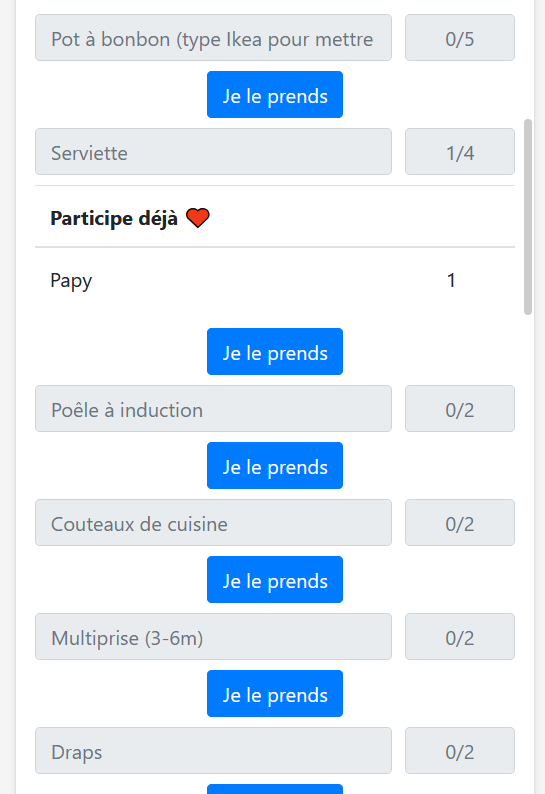
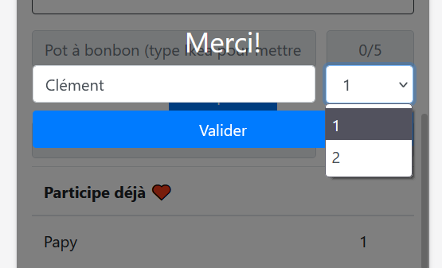

# Liste d'emménagement

## Intro
J'emménage bientôt dans mon nouvel appartement pour mes études et j'ai crée une plateforme pour indiquer à mes proches quels objets ils peuvent m'offrir.
Convient pour les liste de naissance, de mariage, de course, de Noël, ect.

J'ai réalisé ce projet assez rapidement c'est pour cela que certaine partie du code sont difficilement maintenable en cas d'ajout (cf javascript dans liste.php...).

Fonctionne avec Boostrap4, JQuery (non slim pour requête Ajax), Apache, PhpMyAdmin, Php7 (je crois). Sur une architecture MVC.
 
## Configuration

Il vous faudra créer un fichier env.php dans le dossier config:

```
<?php
//Database
define('HOST','mysql-clementjuventinliste.alwaysdata.net');
define('DB_NAME','clementjuventinliste_liste');
define('DB_LOGIN','exemple');
define('DB_PASSWORD','exemple123');

```

HOST pour votre hébergeur, DB_NAME pour le nom de la base de données, DB_LOGIN pour l'identifiant et DB_PASSWORD pour le mot de passe.

## Installation

- Configurer le env.php
- Dans le dossier doc se trouve la structure de la base de données, à compléter selon vos envies. Si quelqu'un pouvait faire un convertisseur csv to mySql pour la table objet ce serait pratique. 
- Télécharger les autres fichiers dans un serveur apache.

## Software screenshots



Ci-dessus on a une vue d'exemple des objets qui pourraient figurer sur votre liste et de la manière dont elle serait affichée.



Ci-dessus on a l'exemple d'un utilisateur qui cliquerait sur 'Je le prends'.

## Licence

GPLv3
